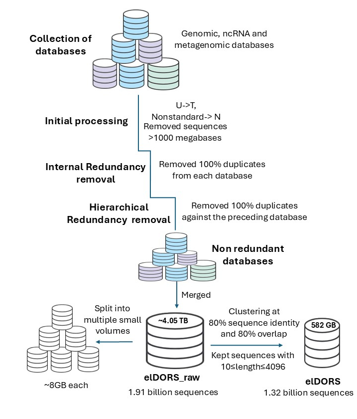
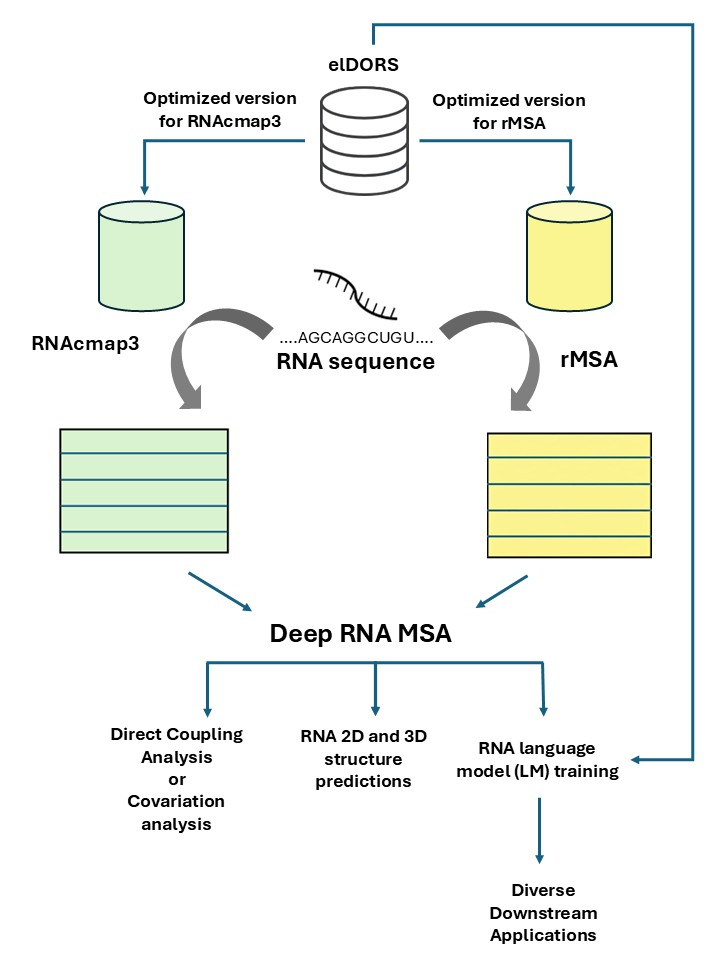

## 1. Overview
While massive sequence databases have recently revolutionized computational protein structure prediction, RNA research has historically lagged due to a lack of consolidated sequence resources. The **elDORS** database bridges this critical gap. By strategically integrating  genomic and metagenomic databases, **elDORS_v1_raw** provides a massive-scale, up-to-date repository of RNA sequence data. Here optimized an 80% sequence-identity clustered version **elDORS_v1** (explicitly designed for efficient use with advanced bioinformatics pipelines.
Our benchmarking demonstrates that elDORS-augmented pipelines match or exceed the alignment depth of massive legacy databases, effectively eliminating the sequence retrieval failures that typically challenge "orphan" RNAs.
To bypass the severe network timeouts and I/O bottlenecks associated with transferring monolithic files, the **3.2 TB** elDORS database is distributed in precisely engineered, multi-volume architectures. These distributions are optimized for high-speed parallel downloads and immediate drop-in compatibility with leading multiple sequence alignment (MSA) pipelines.

---

## 2. Dataset Architecture & Distributions

The total size of the directory is ~3.2 TB. It is divided into four primary **Distributions** and **Pipeline Builds** to suit different computational environments and workflows.

### Summary Table

| Distribution / Pipeline Build | Path / Directory | Size | Description |
| :--- | :--- | :--- | :--- |
| **Raw Sequence Distribution** | `./elDORS_v1_raw` | 1.2 TB | Baseline unclustered RNA sequence data in FASTA format. |
| **Compressed Archive** | `./GZIPPED_elDORS_v1` | 170 GB | 80% sequence-identity (considering 80% overlap) clustered version (elDORS_v1), provided in ~9GB sequence-aware chunks. |
| **rMSA-Optimized Build** | `./rMSA_version_elDORS` | 1.0 TB | Optimized elDORS_V1 for rMSA pipeline |
| **RNAcmap3-Optimized Build** | `./RNAcmap3_version_elDORS` | 861 GB | Optimized elDORS_V1 for RNAcmap3 split-strategy pipeline |

### Directory Structure
```text
elDORS_v1_Database/
├── elDORS_v1_raw/                 (1.2 TB)  - Raw (unclustered) FASTA format sequence database (Sequence-aware ~9GB compressed (gzip) chunks)
├── GZIPPED_elDORS_v1/                    - Compressed elDORS_v1 (80% sequence identitity clustered (with 80% overlap) version)
│   ├── elDORS_v1_chunks/          (170 GB)  - Sequence-aware ~9GB compressed chunks
│   └── [non-chunked zipped files]
├── rMSA_optimized_elDORS/           (1022 GB) - Optimized elDORS_V1 for rMSA pipeline: uncompressed FASTA format elDORS_v1 along with multi-volume BLAST format files 
└── RNAcmap3_optimized_elDORS/       (861 GB)  - Optimized elDORS_V1 for RNAcmap3 split-strategy pipeline
    ├── blast/                     (286 GB)  - Multi-volume BLAST format database optimized for RNAcmap3 pipeline
    └── infernal/                  (575 GB)  - Uncompressed FASTA format elDORS_v1 (multiple volumes) compatible with compatible with RNAcmap3 pipeline

#### 1. Database Curation & Redundancy Removal Pipeline
The elDORS database is built by integrating vast genomic, non-coding RNA (ncRNA), and metagenomic resources. To make this resource computationally efficient, we applied a strict hierarchical redundancy removal and an 80% sequence identity clustering workflow:



#### 2. Downstream Optimization for Structure Prediction Pipelines
To enable immediate drop-in compatibility, the dataset is provided in specialized, pre-indexed builds optimized for cutting-edge RNA multiple sequence alignment (MSA) and contact prediction tools like `rMSA` and `RNAcmap3` and also prcisely curated to ensure efficient downsteam use like RNA language model training using either the sequences from the database or the Multiple sequence alignments generated using the database:

